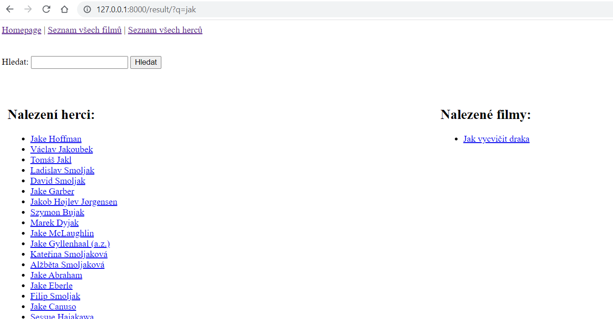

# ČSFD SCRAPE WEB

A simple Django application that scrapes titles and actors from a database of 300 films from CSFD (Czech-Slovak Film Database). On the homepage there is a search that yields results between both movie titles and actor names. The movie detail shows the actors who star in the movie. The actor detail shows the movies in which they star.

In this case, the SQLite database is included in the repository.

## Download the database
The script to download the data is implemented in the management command folder (csfd_app/management/commands/scrape.py). Pro stažení dat je možné použít příkaz:

<code>python manage.py scrape</code>

## Printscreen of application (search - result page)
